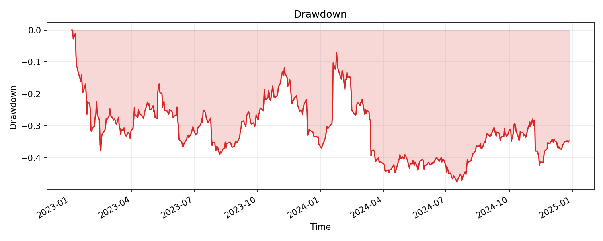

# QuantBench

<p align="center">
  
</p>

QuantBench 是一个面向量化研究者的 AI 工作台：把一句自然语言策略想法，转换成可执行、可复现、可审计的研究实验。

它不是自动交易系统，也不是只会聊天的 bot。QuantBench 的目标是把量化研究中最容易丢失的部分固定下来：数据来源、因子代码、回测配置、指标、图表、警告、研究笔记，以及每次实验的 artifact 目录。



## 项目定位

QuantBench 对标的是 AI research workbench，而不是传统 notebook。用户提出一个研究问题后，系统会通过 Coordinator Agent 调用量化研究技能，完成数据拉取、因子计算、回测、质量检查、图表生成和报告归档。

核心原则：

- **可复现**：每次 run 都保存代码、参数、指标、图表和 manifest。
- **可审计**：不只展示结论，也展示数据质量、样本限制和已知偏差。
- **研究优先**：输出是研究 artifact，不是投资建议或自动下单信号。
- **本地优先**：默认在研究者本地 Python 环境运行，适合快速迭代和调试。

## 已支持能力

- 自然语言触发单标的和截面量化研究。
- Python 回测引擎，支持向量化单标的回测和 cross-sectional 因子回测。
- 美股和 crypto universe 构建，支持 S&P 500 样本研究、当前成交量 Top-N USDT 永续合约截面研究，并显式标注 survivorship/snapshot bias。
- 数据 provider 抽象，当前包含 `yfinance` 美股数据和 CCXT Binance crypto 连接器。
- 数据缓存、DuckDB warehouse、数据质量检查和 artifact store。
- Reviewer 审查引擎，自动输出未来函数、样本外衰减、手续费敏感性、参数稳定性、regime/tail 依赖、换手率、beta 暴露和截面标的集中度检查。
- Experiment Library，支持按 verdict/asset/family/Sharpe 检索历史 run、并排比较指标与 Reviewer finding、查看 parent/child 谱系。
- Factor Library，可从已跑通且经 Reviewer 审查的 run 保存 `compute(df)` 因子代码、参数、verdict、指标和已知局限，作为后续 run 的可修改起点。
- Workflow Skills，支持 `skills_docs/*.md` 工作流规范按请求触发注入，或通过 `--skill` 显式注入，并在 manifest 中记录 `injected_skills`。
- Session fork，从历史 run 继承数据和 universe，只要求模型重写 `compute()`，新 run 会记录 `parent_run_id`。
- 自动产出 metrics、research note、equity curve、drawdown 等研究产物。
- FastAPI 后端和 React/Vite 本地 Web 工作台，用于查看 run、artifact、警告、实验库、对比和谱系。
- 交互式图表面板（equity curve、drawdown、turnover、decile return、cost sensitivity、parameter perturbation、regime decomposition、symbol concentration），零依赖手写 SVG、hover 显示数值；Compare 视图带 Returns Correlation 相关性矩阵；Artifact 浏览器支持 Parquet 文件预览。

## 项目结构

```text
quantbench/
  agent/        Coordinator、LLM 封装和提示词
  api/          FastAPI run API、状态管理和 artifact 读取
  artifact/     每次 research run 的归档存储
  data/         数据 provider、universe、cache 和 DuckDB warehouse
  engine/       单标的与截面回测引擎、指标计算
  factors/      因子库条目、参数提取/覆盖和本地 JSON 存储
  library/      实验库索引、筛选、对比、聚合、谱系和 fork 配置
  review/       Reviewer 审查引擎、verdict 和结构化报告
  skilldocs/    Workflow Skill 文档解析、匹配和 prompt 注入
  skills/       code execution、plot、report、data quality 等研究技能
skills_docs/    可按需注入的工作流 Skill Markdown 文档
web/            React + Vite 本地工作台
docs/assets/    README 与文档图片资产
tests/          CLI、API、数据层、回测引擎测试
```

一次研究运行会落盘到 `runs/<run_id>/`，通常包含：

```text
config.yaml
signal.py
backtest_result.json
review_report.json
equity_curve.png
drawdown.png
research_note.md
manifest.json
```

## 快速开始

安装 Python 依赖：

```bash
uv sync
```

运行 CLI：

```bash
uv run python -m quantbench "在标普500成分股里测试20日动量因子的截面表现，2022-01-01 到 2024-12-31，等权十分位多空组合"
uv run python -m quantbench "构建 top 30 USDT 永续合约的截面 universe，测试20日动量因子的截面表现，2023-01-01到2024-12-31，等权十分位多空组合"
```

查看实验库和对比：

```bash
uv run python -m quantbench library list --verdict PROMISING,STRONG --sort sharpe
uv run python -m quantbench compare run_A run_B
```

保存和复用因子：

```bash
uv run python -m quantbench factor save run_A --name momentum_20d
uv run python -m quantbench factor list --family momentum --min-verdict PROMISING
uv run python -m quantbench factor show momentum_20d
uv run python -m quantbench factor use momentum_20d --param lookback=60 --on "在AAPL上测试，2020-2024"
```

查看或显式使用 Workflow Skills：

```bash
uv run python -m quantbench skill list
uv run python -m quantbench skill show crypto-cross-sectional-workflow
uv run python -m quantbench --skill reviewer-weak-triage "我上一个因子被打成 WEAK，帮我看看下一步"
```

启动 API：

```bash
uv run uvicorn quantbench.api.server:app --reload
```

启动 Web 工作台：

```bash
cd web
npm install
npm run dev
```

Web UI 默认连接本地 FastAPI 服务。

## Roadmap

### 近期

- 打磨 Web 工作台的加载态、失败态和空状态。
- ~~完成运行进度的实时展示，支持 SSE 或 WebSocket 事件流。~~ 已支持：`useRunEvents` 通过 SSE 订阅运行中的 run，见 [useRunEvents.ts](web/src/hooks/useRunEvents.ts)。
- 前端测试框架已引入（Vitest + Testing Library），覆盖了坐标换算、Heatmap 聚合等纯函数和关键组件。
- API/UI 端到端测试已引入（Playwright，`web/e2e/`）：驱动真实的 FastAPI 后端和 Vite 前端，覆盖 run 列表浏览、run 详情、warnings/summary 展示、artifact 打开等关键路径；测试数据通过 `global-setup`/`global-teardown` 播种/清理到 `runs/` 目录，不污染真实历史记录。

### 研究质量

- 支持 point-in-time universe，降低历史成分股回测中的 survivorship bias。
- 扩展 Reviewer 的 stress test 与 benchmark 覆盖范围。
- 扩展数据质量检查，覆盖公司行为、退市、拆股、缺失交易日和异常跳变。

### 数据与执行

- 增强 dataset versioning 和 cache provenance。
- 接入更多资产类别：crypto 截面已支持；futures、macro 和 alternative data 仍待独立设计与接入。
- 为用户自定义研究代码提供可选沙箱执行环境。
- 支持可导出的 experiment bundle，方便分享和复现实验。

### 产品方向

- 扩展 experiment library 的标签治理和批量操作。
- 按标的展开的 Factor IC Heatmap 和多因子 Risk Attribution（需要先有逐标的 IC 持久化和因子模型数据源，v1 用 decile-by-time 热力图和单一 benchmark beta 暂代，详见 [PHASE4.md](PHASE4.md) 第四节）。
- 支持多 session 研究工作流，方便比较策略分支和研究路径。

## 风险声明

QuantBench 生成的是研究产物，不是投资建议。任何回测都可能受到 survivorship bias、look-ahead bias、数据质量、交易成本假设、过拟合和市场状态变化影响。所有结果都应该被复核、复现和压力测试后再用于真实决策。

## License

This project is licensed under the MIT License. See [LICENSE](LICENSE).
