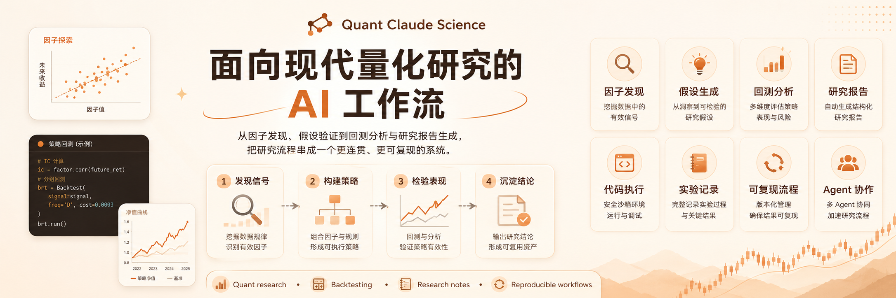
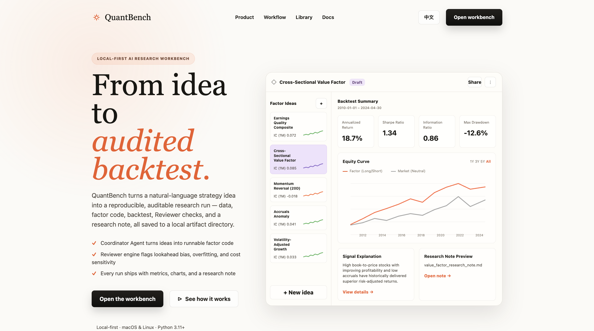
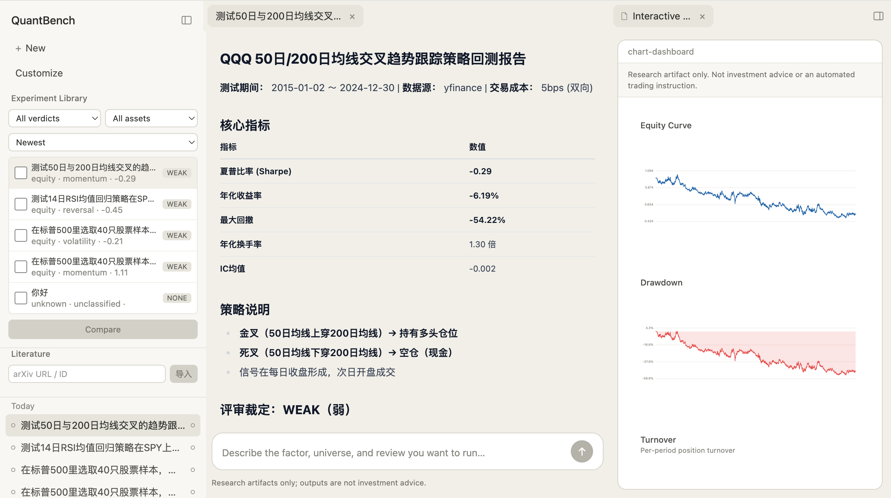
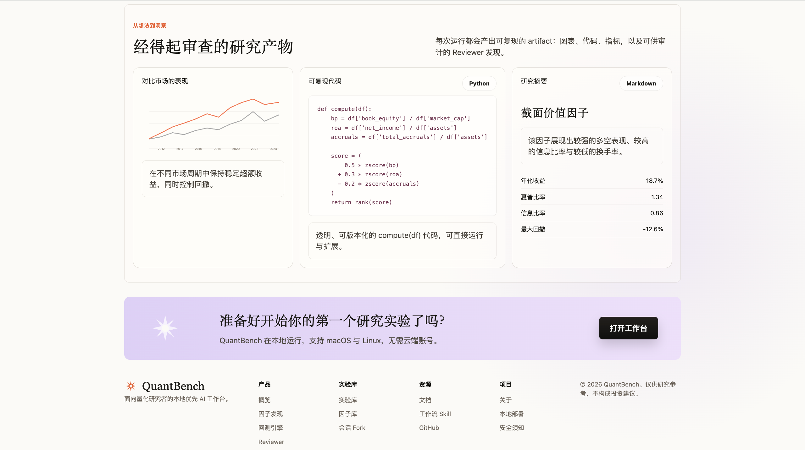
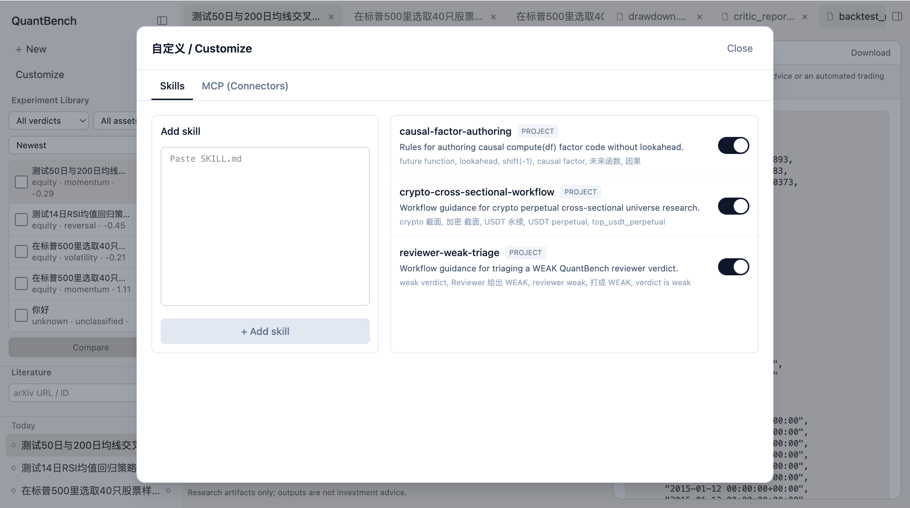
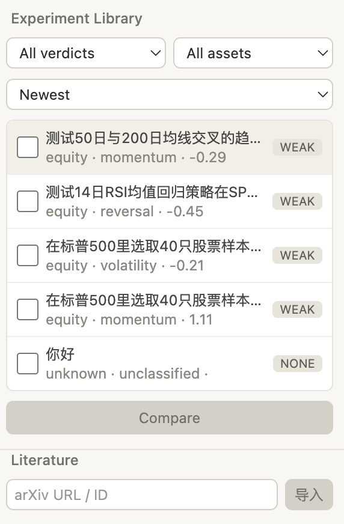

<p align="center">
  
</p>

<h1 align="center">QuantBench</h1>

<p align="center">
  <strong>From idea to audited backtest. One command.</strong>
</p>

<p align="center">
  <a href="#quick-start">Quick Start</a> &nbsp;·&nbsp;
  <a href="#features">Features</a> &nbsp;·&nbsp;
  <a href="#web-workbench">Web Workbench</a> &nbsp;·&nbsp;
  <a href="#cli-usage">CLI Usage</a> &nbsp;·&nbsp;
  <a href="#architecture">Architecture</a> &nbsp;·&nbsp;
  <a href="#roadmap">Roadmap</a>
</p>

<p align="center">
  
  
  
  
</p>

---

QuantBench is a **local-first AI research workbench** for quantitative researchers. Describe a strategy idea in natural language — QuantBench turns it into a reproducible, auditable research run: data sourcing, factor code, backtest, quality checks, charts, and a research note, all saved to a local artifact directory.

It is not an auto-trading system. It is not a chatbot. QuantBench produces **research artifacts** — the kind you can review, reproduce, and hand to a colleague.

<p align="center">
  
</p>

## Quick Start

### Prerequisites

| Tool | Version | Install |
|------|---------|---------|
| Python | 3.11+ | [python.org](https://www.python.org/) |
| uv | latest | `curl -LsSf https://astral.sh/uv/install.sh \| sh` |
| Node.js | 22+ | [nodejs.org](https://nodejs.org/) |
| LLM API key | — | DeepSeek-compatible key configured for LiteLLM |

### Three commands to your first experiment

```bash
# 1. Install dependencies
uv sync

# 2. Seed example research sessions (free, no API key needed)
uv run python -m quantbench examples seed

# 3. Launch the workbench
uv run python -m quantbench serve
```

Open the printed URL. Four pre-generated research sessions are ready to explore — complete with metrics, charts, Reviewer reports, and research notes.

> First launch auto-detects `uv`/`node`/`npm`, runs `npm install` if needed (~1 min), and prints actionable hints if anything is missing.

## Features

### Coordinator Agent

Describe what you want to research in natural language. The Coordinator Agent interprets your intent, pulls data, writes factor code, runs the backtest, triggers quality checks, and produces a full research artifact — no boilerplate.

```bash
uv run python -m quantbench "在标普500成分股里测试20日动量因子的截面表现，2022-01-01到2024-12-31"
```

### Reviewer Engine

Every run is automatically audited. The Reviewer flags lookahead bias, overfitting, cost sensitivity, survivorship bias, capacity constraints, and 20+ other statistical and structural issues. Results carry a verdict: **STRONG**, **PROMISING**, **WEAK**, or **REJECT**.

### Reproducible Artifacts

Each run saves everything to `runs/<run_id>/`:

```
config.yaml          # Full experiment configuration
signal.py            # The exact factor/signal code that ran
backtest_result.json  # Metrics, bootstrap CIs, execution assumptions
review_report.json   # Reviewer findings and verdict
equity_curve.png     # Interactive equity curve chart
drawdown.png         # Drawdown visualization
research_note.md     # Auto-generated research summary
manifest.json        # Provenance: data hashes, LLM usage, skill injections
```

### Experiment Library & Factor Library

Browse, filter, and compare past runs by verdict, asset class, factor family, or Sharpe. Save validated factors to a reusable library. Fork any run to iterate with different parameters while preserving lineage.

### Backtest Engine

- **Single-asset** and **cross-sectional** factor backtests
- `open_t+1` default execution (realistic, not optimistic)
- Liquidity-aware spread/participation-cap costs, borrow costs, funding costs
- Long/short contribution decomposition, beta/size/sector neutralization
- Decile portfolios, turnover tracking, parameter perturbation, regime decomposition

### Universe Construction

- **US equities**: S&P 500 current snapshot and point-in-time constituents
- **Crypto**: Top-N USDT perpetual contracts via CCXT/Binance
- Explicit survivorship/snapshot bias labeling via trust tiers

### MCP & Workflow Skills

Extend QuantBench with MCP servers and workflow skills — paste a `mcpServers` JSON config, toggle servers on/off, all hot-reloaded without restart. Fully aligned with Claude Code's `claude mcp` experience.

## Web Workbench

A React + Vite local workbench for browsing runs, inspecting artifacts, and launching new research.

<p align="center">
  
</p>

<details>
<summary><strong>More screenshots</strong></summary>

<br>

**Research Artifacts** — every run produces reproducible code, charts, and a research note:

<p align="center">
  
</p>

**Customize Panel** — manage workflow skills and MCP connectors from the UI:

<p align="center">
  
</p>

**Experiment Library** — filter and compare past research runs:

<p align="center">
  
</p>

</details>

### Interactive Charts

Zero-dependency hand-drawn SVG charts with hover tooltips: equity curve, drawdown, turnover, decile returns, cost sensitivity, parameter perturbation, regime decomposition, symbol concentration, and returns correlation matrix.

## CLI Usage

**Run a research experiment:**

```bash
# Cross-sectional factor backtest on S&P 500
uv run python -m quantbench "在标普500成分股里测试20日动量因子的截面表现，2022-01-01到2024-12-31，等权十分位多空组合"

# Crypto perpetual cross-sectional research
uv run python -m quantbench "构建 top 30 USDT 永续合约的截面 universe，测试20日动量因子，2023-01-01到2024-12-31"
```

**Experiment Library:**

```bash
uv run python -m quantbench library list --verdict PROMISING,STRONG --sort sharpe
uv run python -m quantbench compare run_A run_B
```

**Factor Library:**

```bash
uv run python -m quantbench factor save run_A --name momentum_20d
uv run python -m quantbench factor list --family momentum --min-verdict PROMISING
uv run python -m quantbench factor use momentum_20d --param lookback=60 --on "在AAPL上测试，2020-2024"
```

**Workflow Skills:**

```bash
uv run python -m quantbench skill list
uv run python -m quantbench --skill reviewer-weak-triage "我上一个因子被打成 WEAK，帮我看看下一步"
```

**MCP Servers:**

```bash
uv run python -m quantbench mcp add-json filesystem '{"command":"npx","args":["-y","@modelcontextprotocol/server-filesystem","/data"]}'
uv run python -m quantbench mcp list
uv run python -m quantbench mcp enable fetch
```

## Architecture

```
quantbench/
  agent/        Coordinator Agent, LLM wrappers, prompts
  api/          FastAPI backend, run state management, artifact serving
  artifact/     Per-run artifact storage
  data/         Data providers, universe builders, cache, DuckDB warehouse
  engine/       Single-asset & cross-sectional backtest engines, metrics
  factors/      Factor library entries, parameter extraction, local JSON store
  library/      Experiment library index, filtering, comparison, lineage, fork
  review/       Reviewer engine, verdict logic, structured reports
  skilldocs/    Workflow skill document parsing, matching, prompt injection
  skills/       Code execution, plotting, reporting, data quality skills
skills_docs/    Workflow skill Markdown documents
web/            React + Vite local workbench
tests/          CLI, API, data layer, backtest engine tests
```

**Runtime state** lives in `~/.quantbench/` by default (override with `QUANTBENCH_HOME`):

```
~/.quantbench/
  data_cache/   Downloaded market data
  runs/         Research run artifacts
  factors/      Saved factor library
  literature/   Imported papers
  api_token     Local API authentication
```

## Local API Security

QuantBench is a **single-user local research tool**. The API binds to `127.0.0.1` with a local token (`QUANTBENCH_API_TOKEN` or `~/.quantbench/api_token`). Do not expose the port to a network. Cross-origin access is restricted to configured localhost origins.

## Roadmap

**Research quality** — expand point-in-time universe coverage, Reviewer stress tests, and statistical guardrail calibration.

**Data & execution** — more asset classes (futures, macro, alternative data), dataset versioning, optional sandboxed code execution, exportable experiment bundles.

**Product** — tag governance, per-symbol Factor IC Heatmap, multi-factor risk attribution, multi-session research workflows.

See [CHANGELOG.md](CHANGELOG.md) for recent releases.

## Disclaimer

QuantBench produces **research artifacts, not investment advice**. All backtests are subject to survivorship bias, look-ahead bias, data quality limitations, transaction cost assumptions, overfitting, and regime change. Results must be reviewed, reproduced, and stress-tested before informing real decisions.

## License

Copyright © 2026 QuantBench contributors.

This project is licensed under the **GNU Affero General Public License v3.0** — you may use, modify, and distribute this software, but any modified version you distribute or deploy as a service must also be released under AGPL-3.0 with full source code.

See [LICENSE](LICENSE) for the full text.
